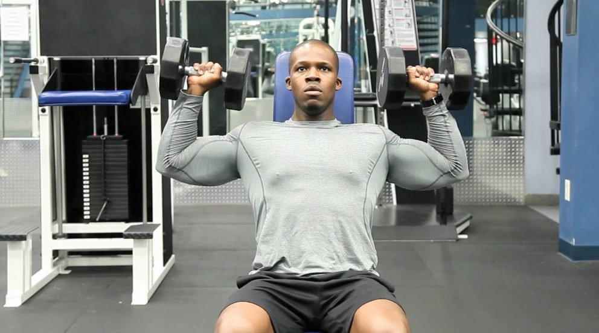
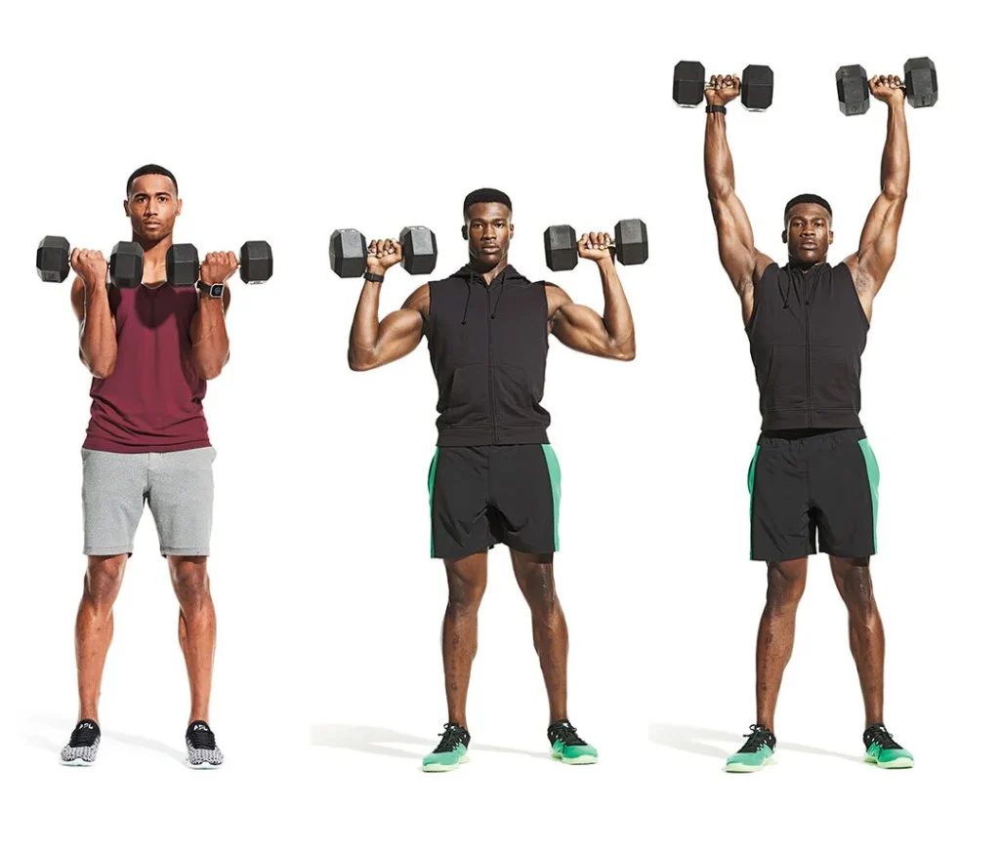
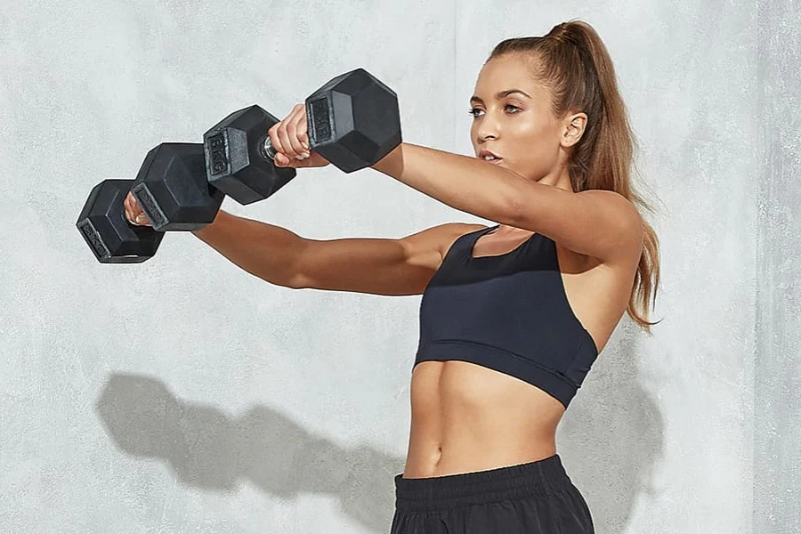
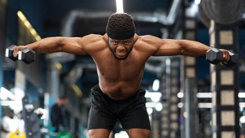
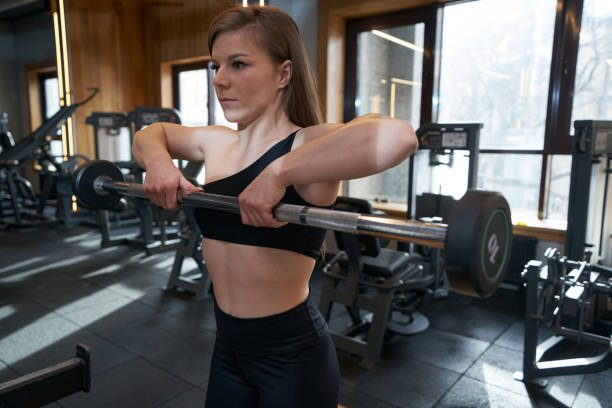
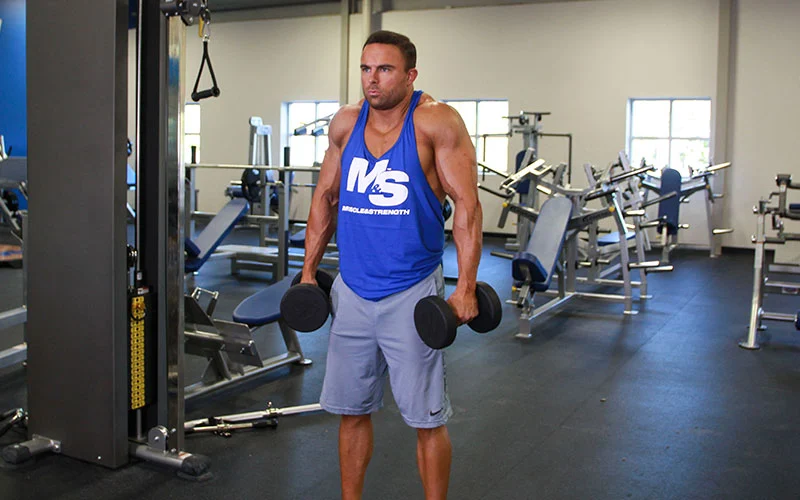
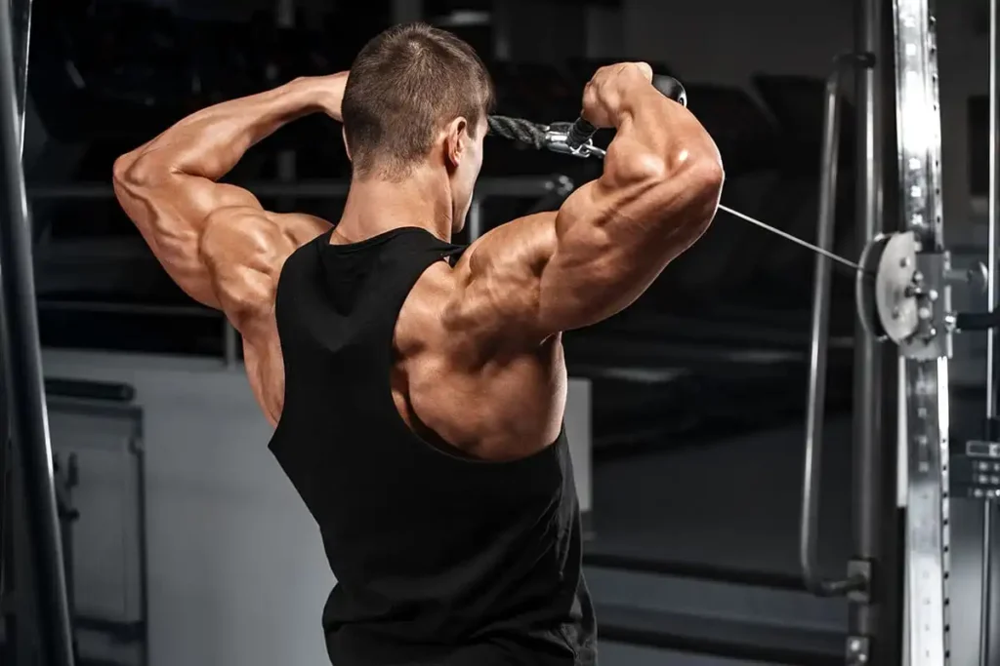
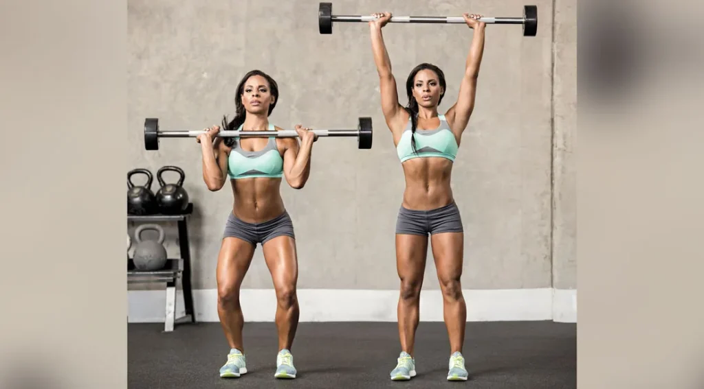
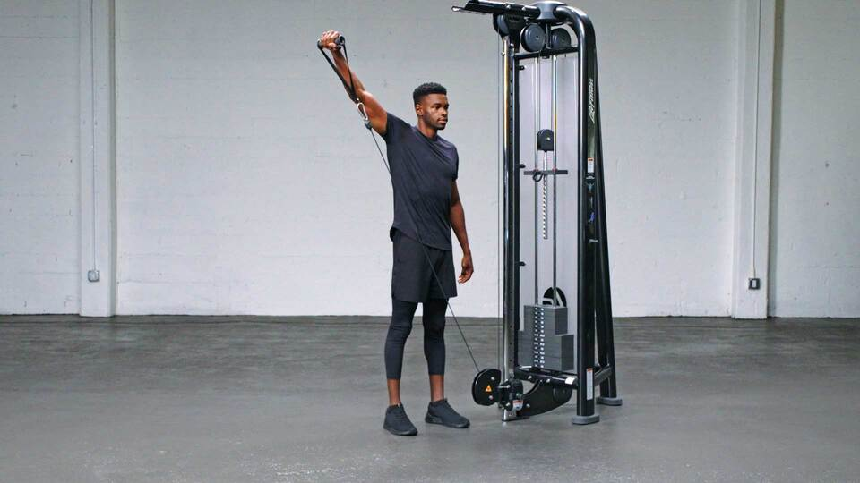
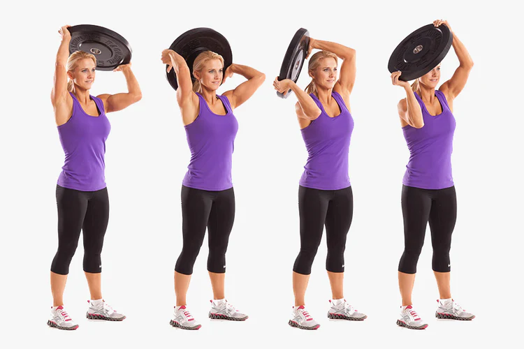

# 肩上推举 (军式推举)

## Overhead Shoulder Press (Military Press)

## オーバーヘッドショルダープレス

# 哑铃肩推

## Dumbbell Shoulder Press

## ダンベルショルダープレス

# 阿诺德推举

## Arnold Press

## アーノルドプレス

# 侧平举

## Lateral Raise

## サイドレイズ

# 前平举

## Front Raise

## フロントレイズ

# 反向飞鸟

## Rear Delt Fly (Reverse Fly)

## リアデルトフライ（リバースフライ）

# 直立划船

## Upright Row

## アップライトロウ

<figure>

<figcaption>

Strong muscular professional female bodybuilder performing upright barbell row during gym workout

</figcaption>

</figure>

# 耸肩

## Shoulder Shrug (Shrug)

## シュラッグ

# 面拉

## Face Pull

## フェイスプル

# 倒立俯卧撑

## Handstand Push-Up

## ハンドスタンドプッシュアップ

# 推举

## Push Press

## プッシュプレス

# 拉力器侧平举

## Cable Lateral Raise

## ケーブルサイドレイズ

# 地雷管推举

## Landmine Press

## ランドマインプレス

# 盘绕动作

## Plate Halo

## プレートヘイロー

