# 杠铃深蹲

## Barbell Back Squat

## バーベルスクワット

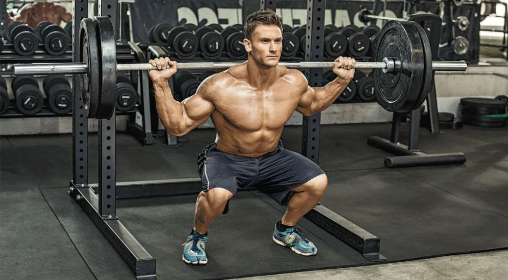

# 杠铃前置深蹲

## Front Squat

## フロントスクワット

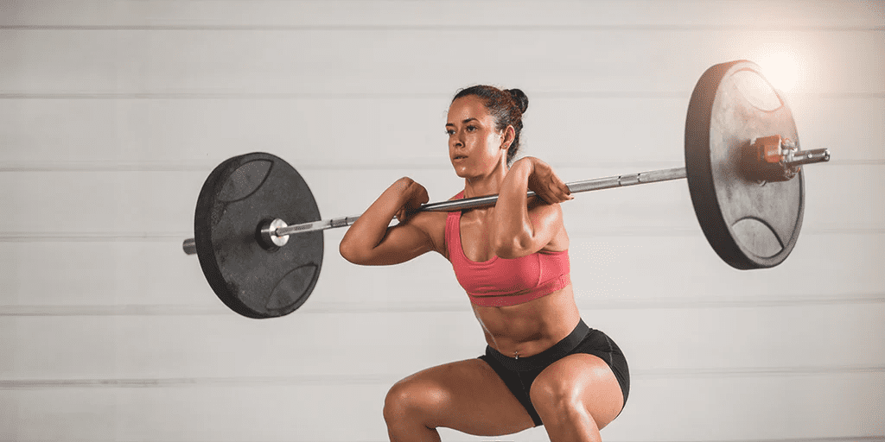

# 腿举机

## Leg Press

## レッグプレス

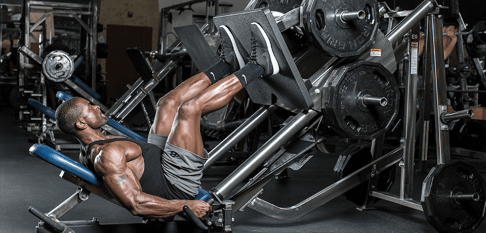

# 弓步蹲

## Lunge

## ランジ

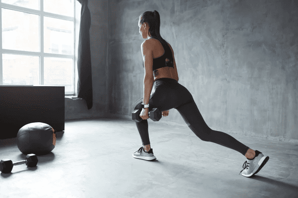

# 腿屈伸

## Leg Extension

## レッグエクステンション

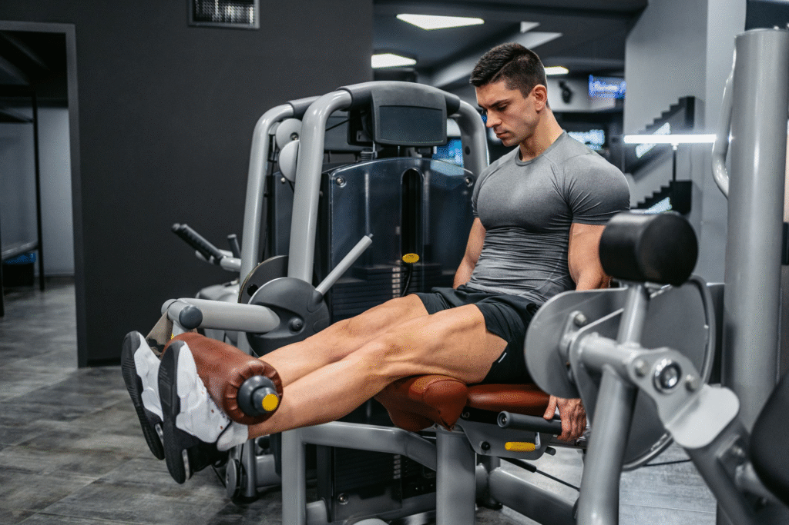

# 腿弯举

## Leg Curl (Hamstring Curl)

## レッグカール

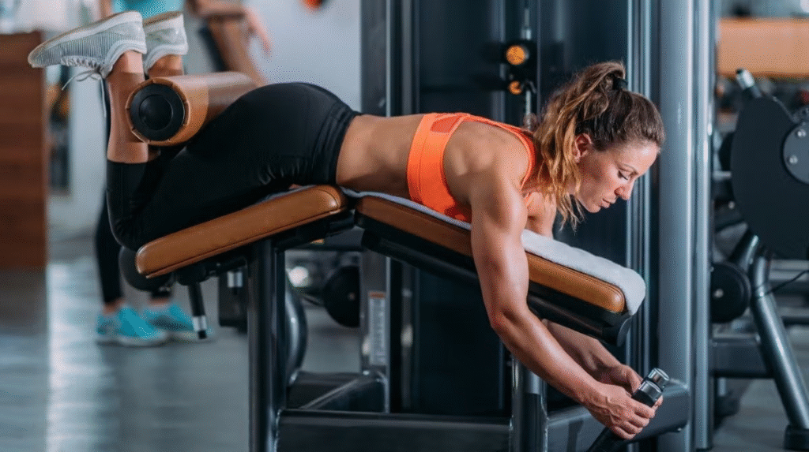

# 罗马尼亚硬拉

## Romanian Deadlift (RDL)

## ルーマニアンデッドリフト

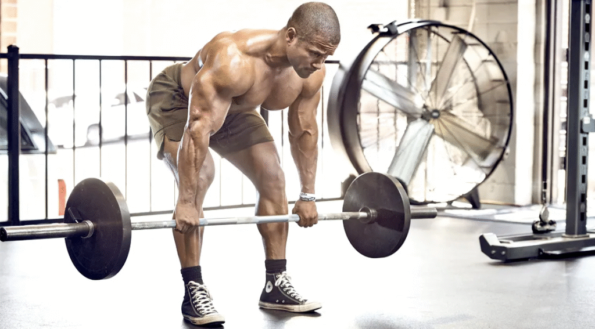

# 站姿提踵

## Calf Raise (Standing)

## カーフレイズ

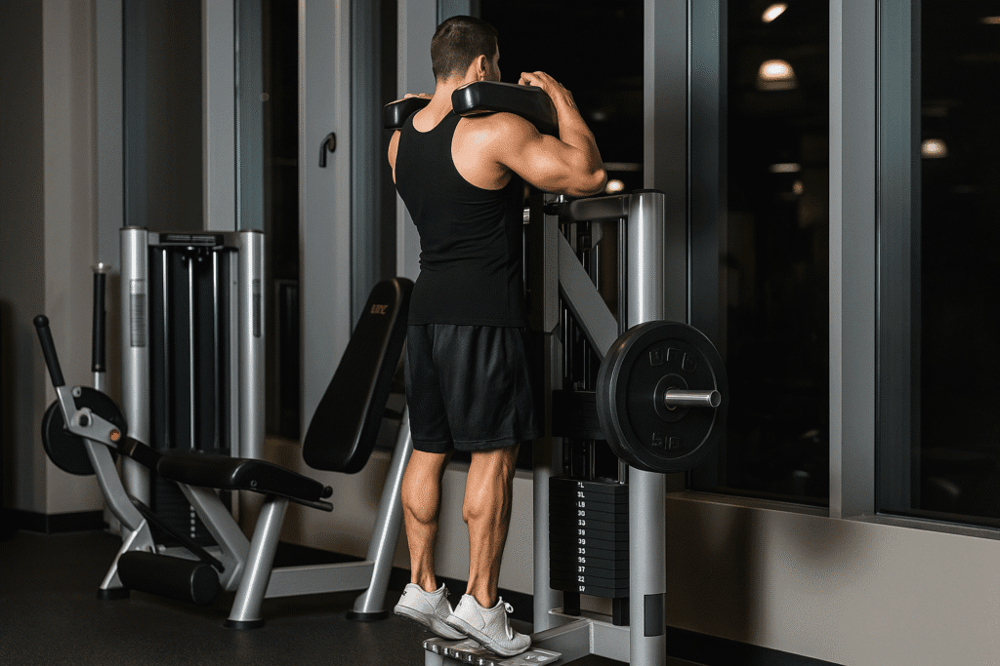

# 坐姿提踵

## Seated Calf Raise

## シーテッドカーフレイズ

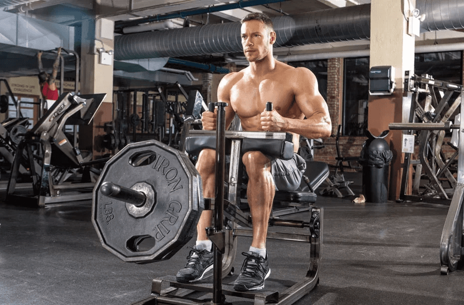

# 保加利亚分腿蹲

## Bulgarian Split Squat

## ブルガリアンスプリットスクワット

# 登台阶

## Step-Up

## ステップアップ

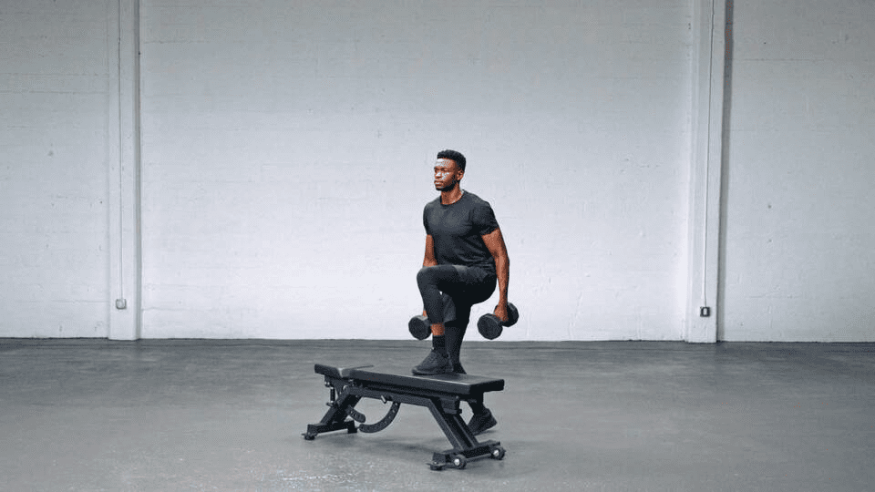

# 臀桥 / 臀推

## Glute Bridge / Hip Thrust

## グルートブリッジ / ヒップスラスト

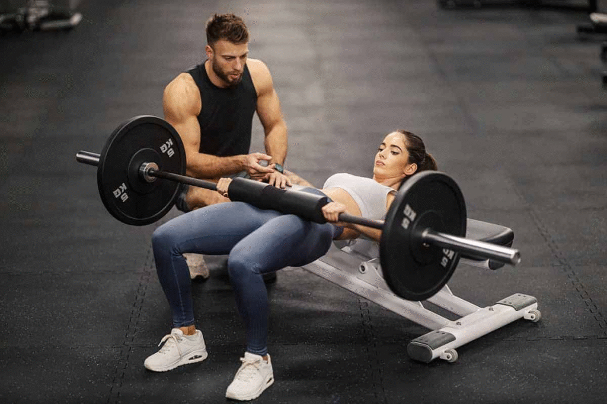

# 腿内收

## Leg Adduction (Inner Thigh)

## レッグアダクション

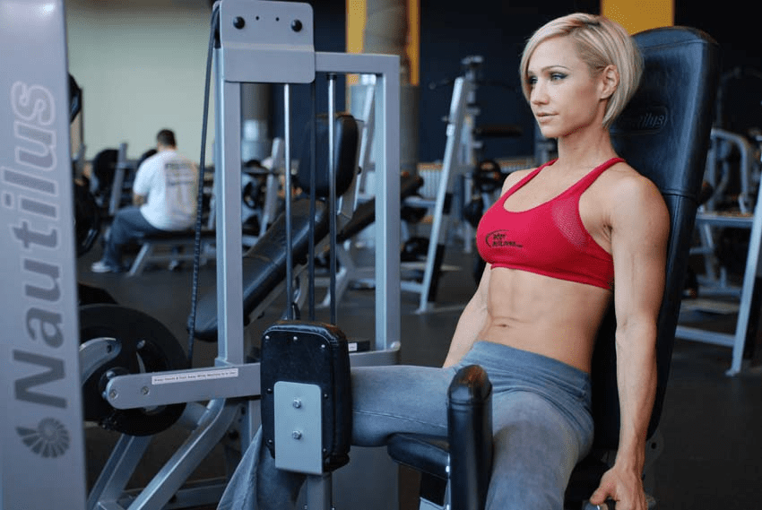

# 腿外展

## Leg Abduction (Outer Thigh)

## レッグアブダクション

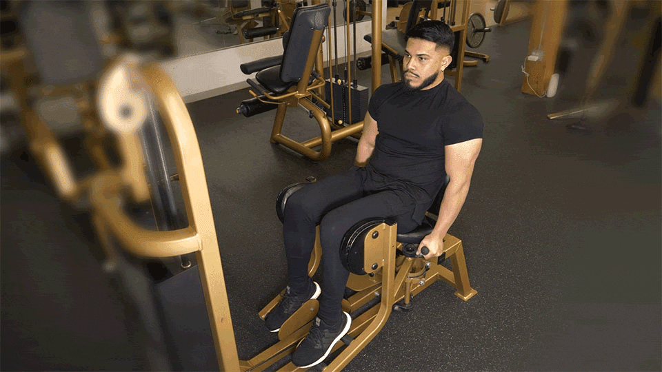
