# 引体向上

## Pull-Up / Chin-Up

## 懸垂（チンニング）

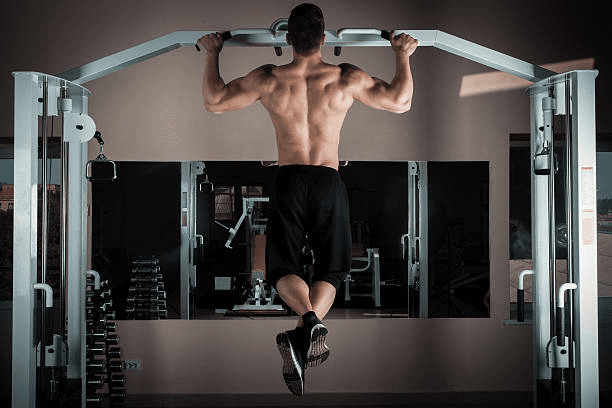

# 高位下拉

## Lat Pulldown

## ラットプルダウン  

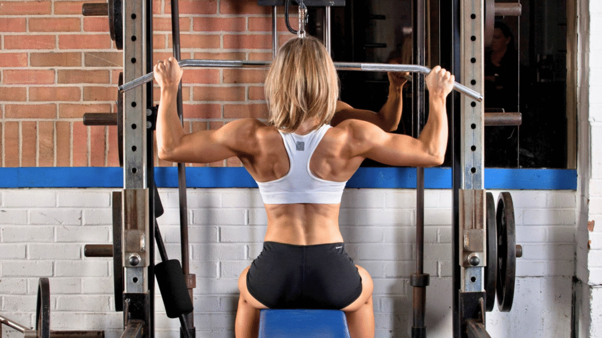

# 杠铃俯身划船

## Barbell Bent-Over Row

## バーベルベントオーバーロウ

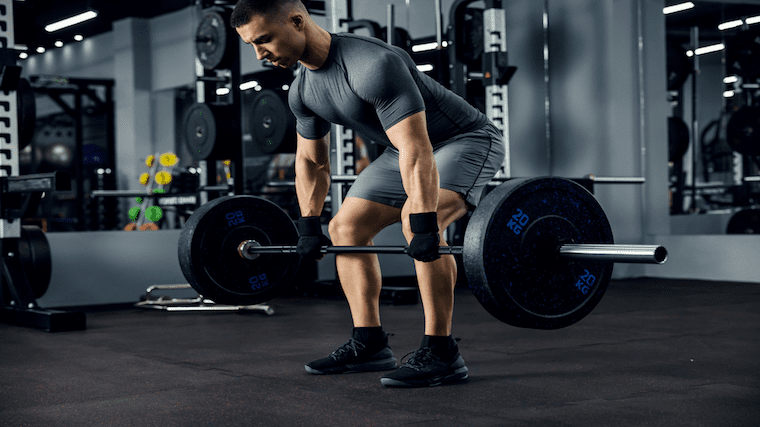

# 单臂哑铃划船

## One-Arm Dumbbell Row

## ワンハンドダンベルローイング  

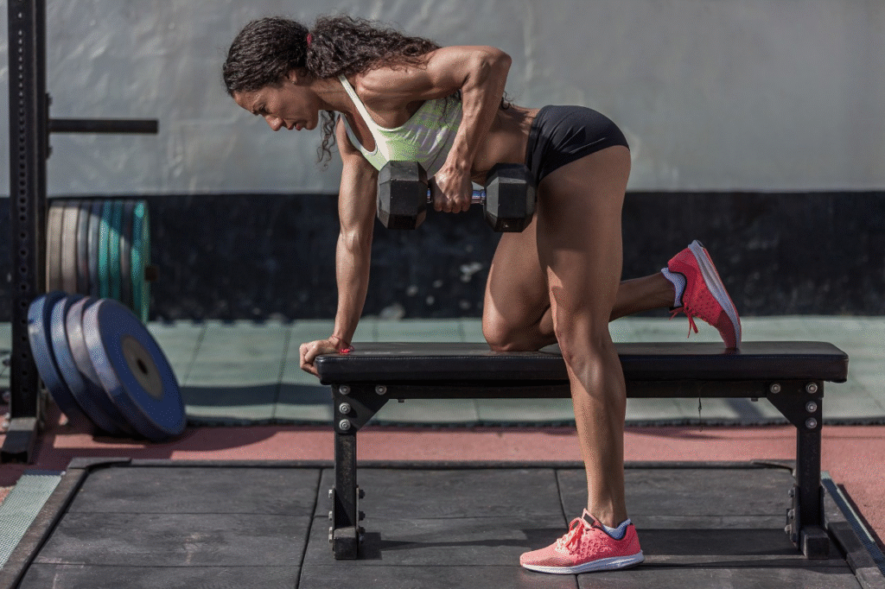

# 坐姿划船

## Seated Cable Row

## シーテッドケーブルロー

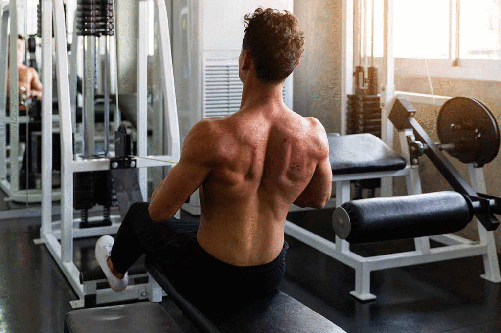

# T杠划船

## T-Bar Row

## Ｔバーロウ

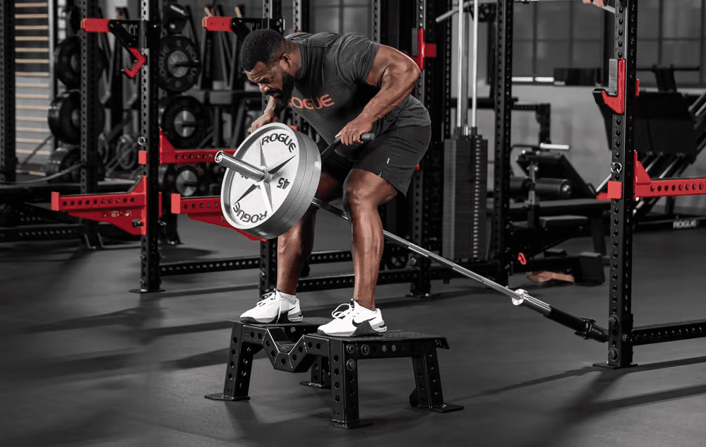

# 传统硬拉

## Deadlift

## デッドリフト

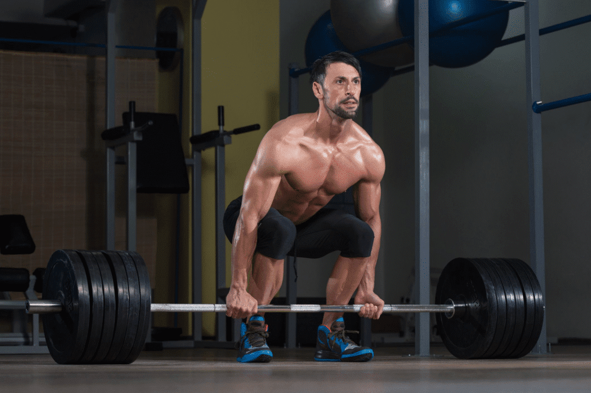

# 架上拉

## Rack Pull

## ラックプル

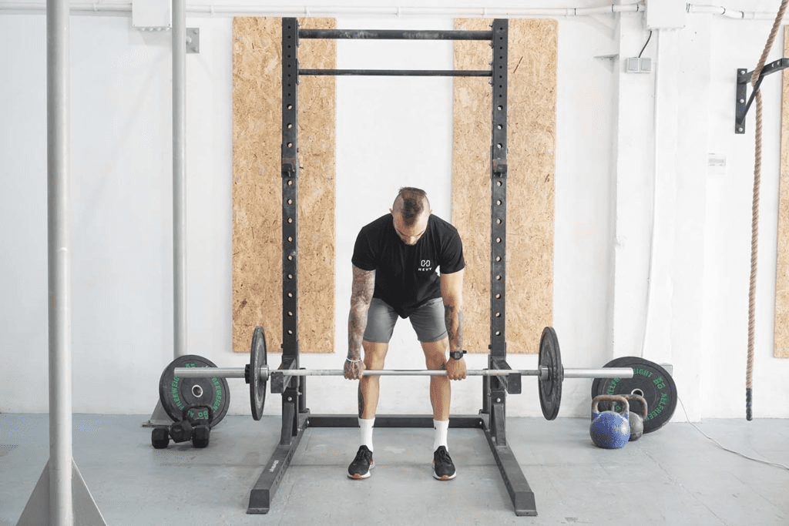

# 俯身挺背

## Back Extension (Hyperextension)

## バックエクステンション（ハイパーエクステンション）

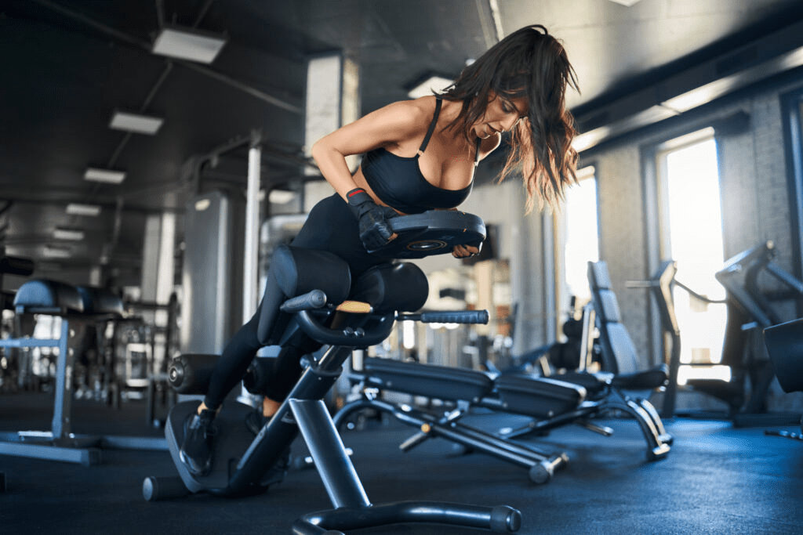

# 早安式

## Good Morning

## グッドモーニング

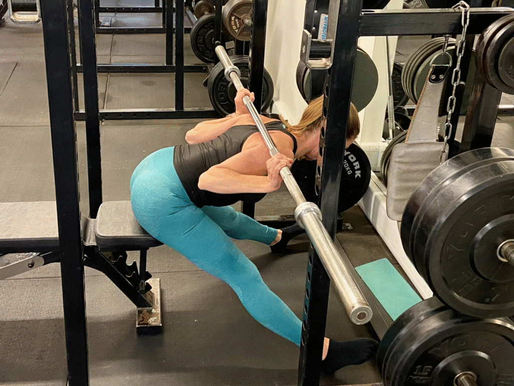

# 超人式

## Superman (Back Raise)

## スーパーマンバックレイズ

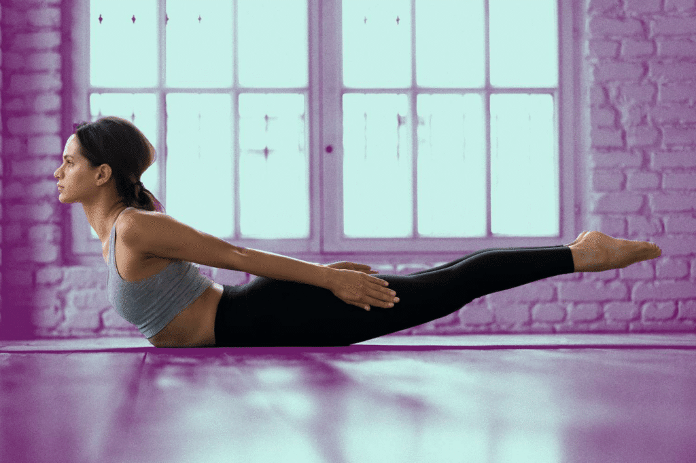

# 面拉

## Face Pull

## フェイスプル

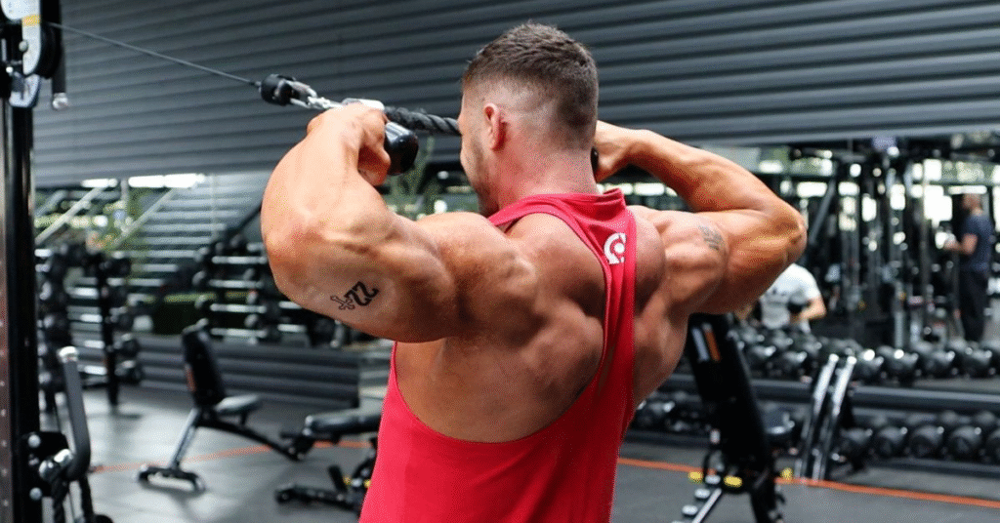

# 哑铃耸肩

## Dumbbell Shrug

## ダンベルシュラッグ

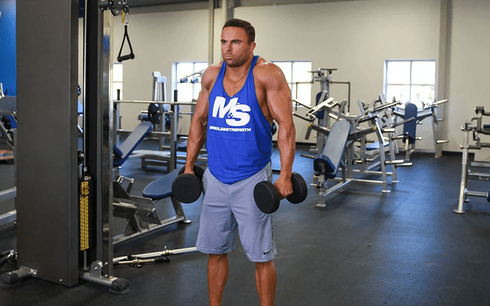

# 反向划船

## Inverted Row

## インバーテッドロウ

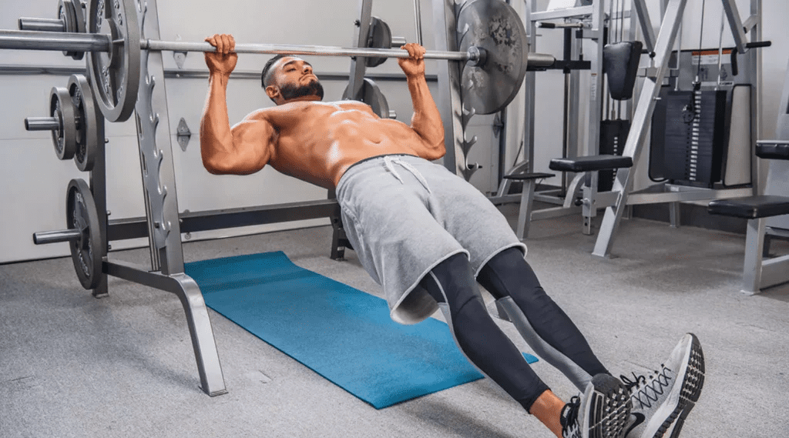
