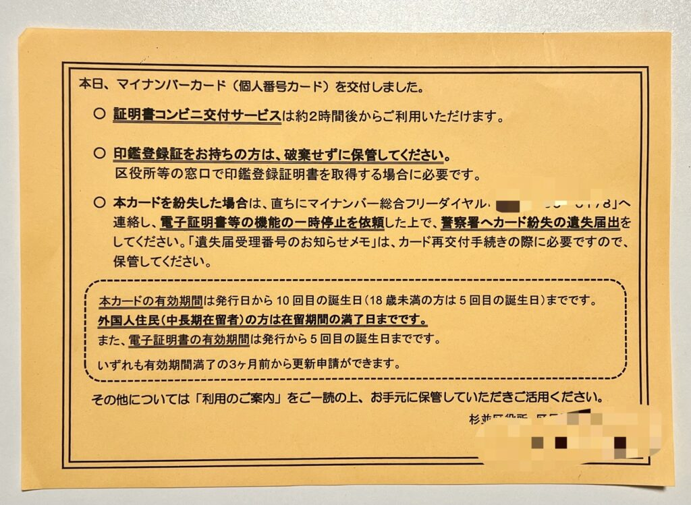

### **1\. 文本整体难度等级**

**N3 - N2 级别。**

这段文字使用了大量官方书面语词汇（如「交付」、「紛失」、「有効期間」）和敬语表达（如「ご利用いただけます」），句子结构清晰但包含了重要的接续语法，非常适合作为 N2 备考的阅读材料。

* * *

### **原句**

本日、_マイナンバーカード（個人番号カード）を交付しました。_

_中文翻译：今天，我们已将“个人番号卡”（My Number Card）交付给您。_

### **句子结构透视 (Sentence Structure Breakdown)**

- **句子的核心：** （私たちが）カードを交付しました。 (我们交付了卡片。)

- **信息的修饰关系：**
    - 本日 (今天) → 限定了「交付しました」的时间。
    
    - マイナンバーカード（個人番号カード） (个人番号卡) → 是「交付しました」的对象。

- **本句关键语法点：** 动词的「ます形」过去式。

### **逐词精解 (Word-by-Word Analysis)**

- **本日 (ほんじつ)** 这是一个名词，是「今日 (きょう)」的正式、书面语说法。在新闻、商务文件或官方通知中非常常见，显得更加郑重。

- **マイナンバーカード** 这是一个来自英语 "My Number Card" 的片假名词。它是日本“个人番号卡”的通用爱称。

- **（個人番号カード (こじんばんごうカード)）** 这是「マイナンバーカード」的正式法定名称，即“个人番号卡”。括号在这里起到了补充说明的作用。

- **を** 助词，读作「お」。在这里，它用来明确指出动作「交付する」所涉及的对象，也就是“卡片”。

- **交付しました (こうふしました)** 这是一个动词。「交付する (こうふする)」是它的基本形（字典形），属于“サ变动词”。意思是“交付、发放”，多用于政府机关或公司向个人发放证件、文件等正式场合。
    - `交付する` → `交付します` (ます形) → `交付しました` (ます形过去式)。表示动作已经完成。

### **表达方式与文化补充 (Expression & Cultural Notes)**

这句话省略了主语。在日语中，如果上下文很明确，主语（特别是“我”或“我们”）常常被省略。这里的上下文是区役所（区政府）发的通知，所以很明显主语是“区役所的工作人员”。

“My Number Card”是日本发给所有居民（包括外国人）的一张带有12位个人编号的IC卡，类似于中国的身份证，用于办理各种行政手续、身份证明等。

### **本句小结 (Key Takeaway)**

本句的核心是掌握在正式文书中常见的高频汉字词，如 **「本日 (ほんじつ)」** 和 **「交付 (こうふ) する」**。同时，理解日语中省略主语的习惯。

* * *

### **原句**

証明書コンビニ交付サービスは約2時間後からご利用いただけます。

_中文翻译：证明书便利店交付服务大约2小时后即可使用。_

### **句子结构透视 (Sentence Structure Breakdown)**

- **句子的核心：** サービスはご利用いただけます。(服务可以使用。)

- **信息的修饰关系：**
    - 証明書コンビニ交付 (证明书便利店交付) → 修饰「サービス」，说明是什么样的服务。
    
    - 約2時間後から (大约2小时后起) → 说明「ご利用いただけます」的起始时间。

- **本句关键语法点：** お/ご～いただけます (敬语可能形)

### **逐词精解 (Word-by-Word Analysis)**

- **証明書 (しょうめいしょ)** 名词，指“证明书、证件”。例如「住民票の写し (じゅうみんひょうのうつし)」（居民证复印件）等。

- **コンビニ交付 (こうふ)** 一个复合名词，由「コンビニ」（便利店）和「交付」（发放）组成，指“在便利店里领取（证明书）”的服务。

- **サービス** 来自英语 "service" 的片假名词，意为“服务”。

- **は** 助词，提示整个句子的主题是“证明书便利店交付服务”。

- **約 (やく)** 副词，意为“大约、大概”。

- **2時間後 (にじかんご)** 名词，意为“2小时后”。

- **から** 助词，表示时间的起点，“从...开始”。

- **ご利用いただけます (ごりよういただけます)** 这是本句最关键的语法点，是一个非常礼貌的敬语表达。让我们来拆解一下：
    - **核心动词**：`利用する (りようする)` - 使用。
    
    - **敬语化**：`ご + 利用 (りよう)` - 将动词名词化并加上敬语前缀「ご」。
    
    - **核心语法**：`いただく` - 它是 `もらう` (得到) 的谦让语。
    
    - **变形**：`いただく` → `いただける` (可能形，能得到) → `いただけます` (ます形)。
    
    - **整体含义**：「ご利用いただけます」字面意思是“我们能得到您的使用”，引申为“您可以（尊贵地）使用”，是「利用できます」或「利用することができます」的非常礼e貌的说法，表达了对客户/用户的尊敬。这是服务行业和公共机关对民众说话时的标准敬语。

### **重点语法点详析：お/ご～いただく**

- **构成**：お/ご + 动词ます形去掉ます + いただく

- **意义**：表示说话人请求对方为自己做某事，或者蒙受对方的恩惠。在这里，它的可能态「お/ご～いただけます」则表示“您可以...”，是「～てもらうことができる」或「～してくれることができる」的敬语形式。

- **简单例句**：
    - 明日、もう一度お電話いただけますか。 (明天您能再给我打个电话吗？)
    
    - こちらの席でお待ちいただけます。 (您可以在这边的座位上等候。)

### **本句小结 (Key Takeaway)**

本句需要重点掌握敬语可能态 **「お/ご～いただけます」** 的用法，这是 N2 听力和阅读中的高频考点。理解它等于掌握了服务场景下的核心敬语之一。

### **原句**

○ 印鑑登録証をお持ちの方は、破棄せずに保管してください。 ○ 区役所等の窓口で印鑑登録証明書を取得する場合に必要です。

_中文翻译： ○ 持有印章登记证的顾客，请不要废弃，妥善保管。 ○ 在区政府等窗口获取印章登记证明书时需要用到它。_

### **句子结构透视 (Sentence Structure Breakdown)**

**第一句：**

- **句子的核心：** （あなたは）保管してください。(请您保管。)

- **信息的修饰关系：**
    - 印鑑登録証をお持ちの (持有印章登记证的) → 修饰「方」(人)。
    
    - 破棄せずに (不要废弃) → 以否定状态修饰动作「保管してください」，说明保管的方式。

- **本句关键语法点：** ～ずに、～てください

**第二句：**

- **句子的核心：** （それが）必要です。(（那个东西）是必要的。)

- **信息的修饰关系：**
    - 区役所等の窓口で (在区政府等窗口) → 限定「取得する場合」的场所。
    
    - 印鑑登録証明書を (印章登记证明书) → 是「取得する」的对象。
    
    - 取得する場合に (在获取的时候) → 限定「必要です」的条件/场合。

- **本句关键语法点：** ～場合に

### **逐词精解 (Word-by-Word Analysis)**

- **印鑑登録証 (いんかんとうろくしょう)** 名词，指“印章登记证”，是一张证明你的印章已在政府机关正式登记的卡片。

- **お持ちの方 (おもちのかた)** 这是一个礼貌的说法。「持つ」的敬语形式是「お持ちになる」。这里用「お持ちの」来修饰「方（かた）」（对“人”的礼貌说法），指“持有...的人”。

- **は** 助词，提示主题。

- **破棄せずに (はきせずに)** 这是一个关键的语法点。
    - **核心动词**：`破棄する (はきする)` - 废弃，销毁。
    
    - **核心语法**：`～ずに` 是 `～ないで` 的书面语形式，表示“不...而...”。它接在动词的ない形词干后。
    
    - **变形**：`する` 的否定是 `しない`，去掉 `ない` 就是 `し`。但 `する` 是一个特殊变形，变成 `せず`。所以是 `破棄せず`。`に` 是一个可选的助词，有时可以省略。
    
    - **意义**：`破棄せずに保管してください` 意思就是 `破棄しないで保管してください` (请不要废弃并保管好)。

- **保管してください (ほかんしてください)**`保管する (ほかんする)` 是“保管”的意思。「～てください」是请求对方做某事的句型。

- **区役所等 (くやくしょなど)**`区役所 (くやくしょ)` 是区政府。「等 (など)」表示“等等”，暗示也包括分所等其他相关机构。

- **の** 助词，表示所属关系，“区政府的窗口”。

- **窓口 (まどぐち)** 名词，指“窗口、柜台”。

- **で** 助词，表示动作发生的场所。

- **印鑑登録証明書 (いんかんとうろくしょうめいしょ)** 名词，“印章登记证明书”。这是需要用印章登记证才能获取的正式文件。

- **を** 助词，表示「取得する」的对象。

- **取得する場合 (しゅとくするばあい)**`取得する (しゅとくする)` 是“取得、获得”的意思。
    - **核心语法**：`～場合 (ばあい)`，接在动词、形容词或名词后面，表示“在...的情况下”。
    
    - `取得する場合` 就是“在获取的时候/情况下”。

- **に** 助词，在这里指向某个特定的时间点或场合，与「場合」搭配，强调“在那个时候”。

- **必要です (ひつようです)** な形容词，表示“必要的、需要的”。

### **表达方式与文化补充 (Expression & Cultural Notes)**

在日本，印章（印鑑/ハンコ）在很多正式场合（如签合同、银行开户）依然具有法律效力，其重要性等同于签名。因此，印章登记和证明是非常重要的行政手续。这张通知提醒人们，即使有了多功能的 My Number Card，旧的印章登记证也不能随便扔掉。

### **本句小结 (Key Takeaway)**

本段的核心是掌握书面语否定形式 **「～ずに」**（相当于「～ないで」）的用法，以及表示假设情况的 **「～場合（は/に）」**。这两个都是N2考试的常客。

* * *

### **原句**

○ 本カードを紛失した場合は、直ちにマイナンバー総合フリーダイヤル「0120-95-0178」へ連絡し、電子証明書等の機能の一時停止を依頼した上で、警察署へカード紛失の遺失届出をしてください。「遺失届受理番号のお知らせメモ」は、カード再交付手続きの際に必要ですので、保管してください。

_中文翻译： ○ 如果遗失了本卡，请立即联系 My Number 综合免费服务热线「0120-95-0178」，在请求暂停电子证书等功能之后，再向警察署提交卡的遗失申报。由于“遗失申报受理号码的通知便条”在办理卡片补发手续时是必需的，所以请妥善保管。_

### **句子结构透视 (Sentence Structure Breakdown)**

这是一个长句，我们把它拆成两部分。

**第一部分核心：** （あなたは）連絡し、依頼した上で、届出をしてください。 (请您联系、在请求之后，再进行申报。)

- **信息的修饰关系：**
    1. 本カードを紛失した場合 (如果遗失了本卡) → 整个动作的前提条件。
    
    3. 直ちに (立即) → 修饰「連絡し」。
    
    5. マイナンバー総合フリーダイヤルへ (向...热线) → 「連絡し」的方向。
    
    7. 電子証明書等の機能の一時停止を (电子证书等功能暂停) → 是「依頼した」的对象。
    
    9. 警察署へ (向警察署) → 「届出をしてください」的方向。
    
    11. カード紛失の遺失届出 (卡的遗失申报) → 是「してください」的具体内容。

- **本句关键语法点：** ～場合は、～た上で、～てください

**第二部分核心：** 「メモ」は、必要ですので、保管してください。 (“便条”是必要的，所以请保管好。)

- **信息的修饰关系：**
    1. 遺失届受理番号のお知らせ (遗失申报受理号码的通知) → 修饰「メモ」。
    
    3. カード再交付手続きの際に (在补办卡的手续时) → 限定「必要です」的场合。

- **本句关键语法点：** ～際に、～ので

### **逐词精解 (Word-by-Word Analysis)**

- **本カード (ほんカード)** 「本～」是一个接头词，表示“本...、该...”，用于指代当前正在讨论的事物。非常正式的书面语。例如：本日(今天)、本社(本公司)。

- **紛失した場合 (ふんしつしたばあい)**`紛失する (ふんしつする)` 是“丢失、遗失”的意思。`紛失した` 是其过去式。`～た場合は` 表示“在发生了...的情况下”。

- **直ちに (ただちに)** 副词，意为“立刻、马上”，比「すぐ」更正式、更有紧迫感。

- **フリーダイヤル** 来自英语 "free dial" 的片假名，指“免费服务热线”。

- **へ** 助词，表示方向。

- **連絡し (れんらくし)**`連絡する (れんらくする)` 的中止形。在连接多个动词时，可以用 `～て` 形式，也可以用这种更书面的中止形（ます形去掉ます）。`連絡して` 和 `連絡し` 在这里意思相同。

- **電子証明書等 (でんししょうめいしょなど)** 名词，“电子证书等”。

- **機能 (きのう)** 名词，“功能”。

- **一時停止 (いちじていし)** 名词，“暂时停止”。

- **依頼した上で (いらいしたうえで)** 这是一个非常重要的N2语法点。
    - **核心动词**：`依頼する (いらいする)` - 委托，请求。
    
    - **核心语法**：`～た上で`，接在动词`た形`后面。
    
    - **意义**：表示“做完A之后，接着做B”。它强调A是B的前提或准备步骤，有很强的顺序感。和单纯的 `～てから` 相比，`～た上で` 更加正式，并强调前项动作的完成对后项很重要。
    
    - **简单例句**：よく考えた上で、お返事します。(经过仔细考虑之后，再给您答复。)

- **警察署 (けいさつしょ)** 名词，“警察署、警察局”。

- **遺失届出 (いしつとどけで)** 名词，“遗失申报”。

- **～をしてください**`届出をする` 是一个动词短语。「～をしてください」是 `～てください` 的一种形式，当动词是“名词+する”类型时，常把 `を` 放在中间。

- **遺失届受理番号 (いしつとどけじゅりばんごう)** 名词，“遗失申报受理号码”。

- **お知らせメモ (おしらせメモ)** 名词，“通知便条”。

- **再交付 (さいこうふ)** 名词，“再次发放、补办”。

- **手続き (てつづき)** 名词，“手续”。

- **の際に (のさいに)**`際 (さい)` 是一个名词，意思与 `時 (とき)` 相近，但更加正式，常用于公共告示和商务场合。`～の際に` / `～際に` 表示“在...的时候”。

- **ので** 接续助词，表示原因、理由。因为前面的事实是客观存在的，所以导致后面的结果。

### **本句小结 (Key Takeaway)**

这个长句是典型的官方指示性文字。核心是理解动作的先后顺序和逻辑关系。必须掌握 **「～た上で」** 表示“做完A再做B”的强顺序感，以及正式场合下表示“时候”的 **「～際に」**。

* * *

### **原句**

本カードの有効期間は発行日から10回目の誕生日（18歳未満の方は5回目の誕生日）までです。 外国人住民（中長期在留者）の方は在留期間の満了日までです。 また、電子証明書の有効期間は発行日から5回目の誕生日までです。 いずれも有効期間満了の3ヶ月前から更新申請ができます。

_中文翻译： 本卡的有效期是从发行日起至第10个生日（未满18岁者为第5个生日）。 外国居民（中长期在留者）的有效期至在留期间的到期日为止。 另外，电子证书的有效期是从发行日起至第5个生日。 以上各项均可在有效期满的3个月前开始申请更新。_

### **句子结构透视 (Sentence Structure Breakdown)**

这是一个复合段落，由四个独立的句子构成，逻辑清晰。

- **第一句核心：** 有効期間は～誕生日までです。(有效期到...生日为止。)

- **第二句核心：** （有効期間は）満了日までです。(（有效期）到期日为止。)

- **第三句核心：** 有効期間は～誕生日までです。(有效期到...生日为止。)

- **第四句核心：** （あなたは）更新申請ができます。(您可以申请更新。)

- **信息修-饰关系（第四句）：**
    - いずれも (所有这些) → 指代前面提到的所有有效期。
    
    - 有効期間満了の3ヶ月前から (从有效期满的3个月前起) → 限定「できます」的时间起点。

### **逐词精解 (Word-by-Word Analysis)**

- **有効期間 (ゆうこうきかん)** 名词，“有效期限”。

- **発行日 (はっこうび)** 名词，“发行日、签发日”。

- **～回目 (～かいめ)** 接尾词，表示“第...次/回”。`10回目` 就是“第10次”。

- **誕生日 (たんじょうび)** 名词，“生日”。

- **未満 (みまん)** 名词，接在数字后表示“未满...、不到...”。`18歳未満` 指的是不满18岁的人。

- **まで** 助词，表示终点，“到...为止”。

- **外国人住民 (がいこくじんじゅうみん)** 名词，“外国居民”。

- **中長期在留者 (ちゅうちょうきざいりゅうしゃ)** 名词，“中长期在留者”，指在日本有合法长期签证的外国人。

- **在留期間 (ざいりゅうきかん)** 名词，“在留期间”，指签证允许停留在日本的期限。

- **満了日 (まんりょうび)** 名词，“期满之日、到期日”。

- **また** 接续词，表示“另外、而且”，用于补充信息。

- **いずれも** 副词，意为“（两者或两者以上的）每一个、任何一个都”，在这里指代前面提到的所有有效期。

- **満了 (まんりょう)** 名词或サ变动词，“期满”。

- **～ヶ月前 (～かげつまえ)** “...个月前”。`3ヶ月前` 是“3个月前”。

- **更新申請 (こうしんしんせい)** 名词，“更新申请”。

- **できます** 动词 `できる` 的ます形，表示“能够、可以”，是可能形。

### **本句小结 (Key Takeaway)**

本段内容主要是信息告知，语法相对简单。重点是积累与行政手续相关的词汇，如 **「有効期間」、「発行日」、「満了日」、「更新申請」** 等。同时注意 **「未満」** 和 **「いずれも」** 的用法。

* * *

### **原句**

その他については、「利用のご案内」をご一読の上、お手元に保管していただきご活用ください。

_中文翻译： 关于其他事项，请仔细阅读一遍《使用指南》后，保管在手边以便活用。_

### **句子结构透视 (Sentence Structure Breakdown)**

- **句子的核心：** （あなたは）保管していただきご活用ください。(请您保管并活用。)

- **信息的修饰关系：**
    - その他については (关于其他) → 限定了本句讨论的范围。
    
    - 「利用のご案内」を (《使用指南》) → 是「ご一読の上」的对象。
    
    - ご一読の上 (在阅读一遍之后) → 说明「保管していただき」之前的动作。
    
    - お手元に (在手边) → 说明「保管して」的场所。

- **本句关键语法点：** ～については、～の上、～ていただく、ご～ください

### **逐词精解 (Word-by-Word Analysis)**

- **その他 (そのほか/そのた)** 名词，意为“其他、另外”。

- **については** 复合助词，由 `に` + `ついて` + `は` 构成，用于提出一个话题并加以说明，“关于...”。

- **「利用のご案内」 (りようのごあんない)** 专有名词，《使用指南》。

- **ご一読の上 (ごいちどくのうえ)** 这又是一个非常正式的书面语表达。
    - `一読 (いちどく)` - 读一遍。
    
    - `ご一読` - 加上敬语前缀 `ご`。
    
    - **核心语法**：`～の上 (で)`。当它接在“名词+の”或动词`た形`后面时，意思与 `～た上で` 类似，表示“做完...之后”。`ご一読の上` = `一読した上で`。

- **お手元に (おてもとに)**`手元 (てもと)` 指“手边、身边”。加上敬语前缀 `お`，表示对对方的尊敬。`お手元に保管する` 就是“保管在您的手边”。

- **保管していただき (ほかんしていただき)**`保管する` → `保管して` (`て形`)。 `～ていただく` 是 `～てもらう` 的谦让语，表示请求对方为自己做某事，并对此心怀感激。`保管していただき` 比 `保管してください` 更加礼貌和委婉，带有“劳驾您帮忙保管”的语感。

- **ご活用ください (ごかつようください)** 这是请求对方做某事的敬语形式。
    - **核心动词**：`活用する (かつようする)` - 活用，有效利用。
    
    - **核心语法**：`お/ご + 动词ます形去掉ます + ください`。这是比 `～てください` 更为尊敬的请求表达方式。
    
    - `ご活用ください` = `活用してください` 的尊敬语。

### **本句小结 (Key Takeaway)**

本句是敬语表达的集大成者。需要牢记三个核心敬语模式：

1. **～の上 (うえ)**：书面语，表示“...之后”。

3. **～ていただく**：谦让语，表示“请您（为我）做...”。

5. **お/ご～ください**：尊敬语，表示“请您做...”。 熟练运用这些，你的日语正式程度将大大提升。

* * *

### **最终总结**

### **生词列表 (Vocabulary List)**

| 单词 | 读音 | 中文意思 |
| --- | --- | --- |
| 本日 | ほんじつ | 今天 (正式说法) |
| 交付 | こうふ | 发放，交付 |
| 証明書 | しょうめいしょ | 证明书 |
| 破棄 | はき | 废弃，销毁 |
| 保管 | ほかん | 保管 |
| 印鑑登録証 | いんかんとうろくしょう | 印章登记证 |
| 取得 | しゅとく | 取得，获得 |
| 窓口 | まどぐち | 窗口，柜台 |
| 必要 | ひつよう | 必要，需要 |
| 紛失 | ふんしつ | 丢失，遗失 |
| 直ちに | ただちに | 立刻，马上 |
| 連絡 | れんらく | 联系 |
| 電子証明書 | でんししょうめいしょ | 电子证书 |
| 機能 | きのう | 功能 |
| 一時停止 | いちじていし | 暂时停止 |
| 依頼 | いらい | 委托，请求 |
| 警察署 | けいさつしょ | 警察署 |
| 遺失届出 | いしつとどけで | 遗失申报 |
| 再交付 | さいこうふ | 补发，再次交付 |
| 手続き | てつづき | 手续 |
| 有効期間 | ゆうこうきかん | 有效期 |
| 発行日 | はっこうび | 发行日 |
| 未満 | みまん | 未满 |
| 在留期間 | ざいりゅうきかん | 在留期间 |
| 満了日 | まんりょうび | 到期日 |
| いずれも | いずれも | 任何一个都，全都 |
| 更新申請 | こうしんしんせい | 更新申请 |
| 一読 | いちどく | 读一遍 |
| 活用 | かつよう | 活用，有效利用 |
| 総合 | そうごう |  |
|  |  |  |

### **语法清单 (Grammar Checklist)**

| 语法点 | 构成方式 | 功能与解释 |
| --- | --- | --- |
| **お/ご～いただけます** | お/ご + Vます(去掉ます) + いただけます | "可以（做某事）"的非常礼貌的说法，是敬语中的谦让语可能态，比「～できます」更尊敬。 |
| **～ずに** | Vない(去掉ない) + ずに | "不...而..."，是「～ないで」的书面语形式，用于连接前后两个动作。 |
| **～場合 (ばあい)** | V/A/N + 場合 | "在...的情况下"，用于假设某种情况。 |
| **～た上で (～たうえで)** | Vた + 上で | "在做了...之后"，强调前一个动作是后一个动作的前提或准备，顺序感强，比「～てから」更正式。 |
| **～際に (～さいに)** | V/Nの + 際に | "在...的时候"，是「～とき」的正式说法，常见于书面语和正式场合。 |
| **～の上 (～のうえ)** | Vた/Nの + 上 | "在...之后"，与「～た上で」意思相近，同样是正式的书面语。 |
| **～ていただく** | Vて + いただく | "请您（为我）做..."，是「～てもらう」的谦让语，表达请求并带有感谢的语气。 |
| **お/ご～ください** | お/ご + Vます(去掉ます) + ください | "请您做..."，是「～てください」的尊敬语形式，更加礼貌。 |
|  |  |  |

# ～ていただく 是 ～てもらう 的谦让语，

到底什么意思。 一会儿是用户得到， 一会是有劳驾您帮忙保管

我们来把「～ていただく」这个语法点彻底拆解清楚。

### **核心：永远是「我方得到恩惠」**

首先，请你牢牢记住一个核心概念： 无论是「～てもらう」还是它的谦让语「～ていただく」，**句子的主语（常常省略）永远是动作的接受者**。整个句子的核心视角是“我（或我方）收到了别人为我做某事的恩惠”。

- **もらう**:（从平辈/晚辈那里）得到。

- **いただく**:（从长辈/上级/客户那里）**领受、蒙受**。这是把自己放低，把对方抬高。

所以，「～ていただく」的字面意思就是“**我（谦卑地）领受了（您）为我做...的恩惠**”。

* * *

### **为什么会有两种看起来不同的翻译？**

“一会儿是用户得到，一会儿是劳驾您帮忙”，其实是这个核心意思在**不同句式**下的两种应用场景。它们本质上是一回事。

我们来看两种情况：

### **情况一：作为陈述句（我得到了...）**

当「～ていただく」用在句末，作为一个完整的陈述时，它表达的是**感谢和事实**。

**例1：** 先生に日本語を教えていただきました。

- **直译**：我（谦卑地）领受了老师教我日语的恩惠。

- **自然翻译**：老师教了我日语。（这句话里包含了深深的谢意）

在这里，就是你理解的“用户得到”。我得到了“老师教我”这个动作带来的好处。

**例2：** 部長に書類を確認していただきました。

- **直译**：我（谦卑地）领受了部长为我确认文件的恩惠。

- **自然翻译**：部长帮我确认了文件。（同样，充满感激）

### **情况二：作为请求/指示句（请您为我...）**

这是让你困惑的地方。当「～ていただく」用在请求或指示的语境中时，它变成了一种**极其委婉和礼貌的请求方式**。

想象一下，直接说「保管してください」（请保管）是一种命令或直接请求。

而说「保管していただく」呢？

**保管していただき、ご活用ください。** (原文的用法)

这句话的「保管していただき」其实是一个中顿，它背后的逻辑是： “**我们希望（谦卑地）领受您为我们保管的恩惠，然后请您活用它。**”

看，核心意思没变！说话人（区役所）把自己放在一个很低的位置上，把一个本该是“指示”的行为，包装成了一个“我们请求领受您的恩惠”的表达。

- **直接请求**：Please store it. (保管してください)

- **「～ていただく」式的请求**：We would be grateful if you would do us the favor of storing it. (保管していただく)

这就产生了“劳驾您”、“麻烦您”的语感。因为它不是在命令你，而是在请求你施予“保管”这个恩惠。

**再看一个更常见的请求句式：**

「～ていただけますか。」 (可以请您为我...吗？)

**例：** この漢字の読み方を教えていただけますか。

- **直译**：我能（谦卑地）领受您教我这个汉字读法的恩惠吗？

- **自然翻译**：可以教一下我这个汉字怎么读吗？ / 劳驾您教我一下...

这是一种非常礼貌的提问。你不是在问对方“有没有能力教”，而是在问“我有没有这个荣幸，得到您的教导”。

### **总结与对比**

| 表达方式 | 语感 | 核心逻辑 |
| --- | --- | --- |
| **～てください** | **直接请求/指示** | 你做。（焦点在对方的动作上） |
| **～てくれますか** | **普通请求** | 你能为我做吗？（焦点在对方的意愿上） |
| **～ていただけますか** | **非常礼貌的请求** | 我能有幸得到你为我做...的恩惠吗？（焦点在我方能否“领受恩惠”上，非常委婉） |
| **～ていただきました** | **陈述事实+感谢** | 我已经有幸得到了...的恩惠。（焦点在我方已经收到的恩惠和感激之情） |

所以，你看到“劳驾您帮忙保管”这个翻译，正是因为说话人通过使用「～ていただく」，把自己放低，把保管这个行为的决定权和恩惠完全交给了听话人（用户），从而营造出一种“给您添麻烦了，但还是拜托您”的极其礼貌的氛围。

**记住：视角永远是“我方得到恩惠”。**

- 已经得到了 → **感谢**。

- 希望得到 → **极其礼貌的请求**。
