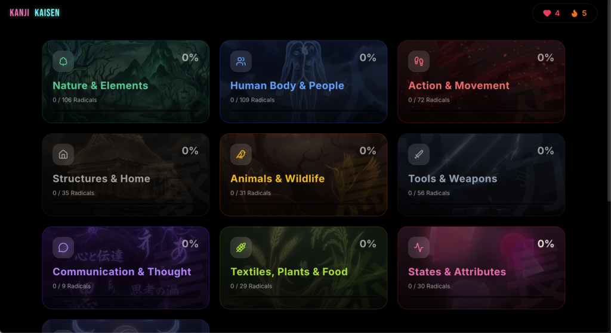
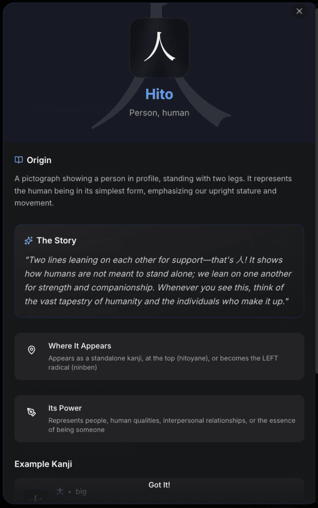
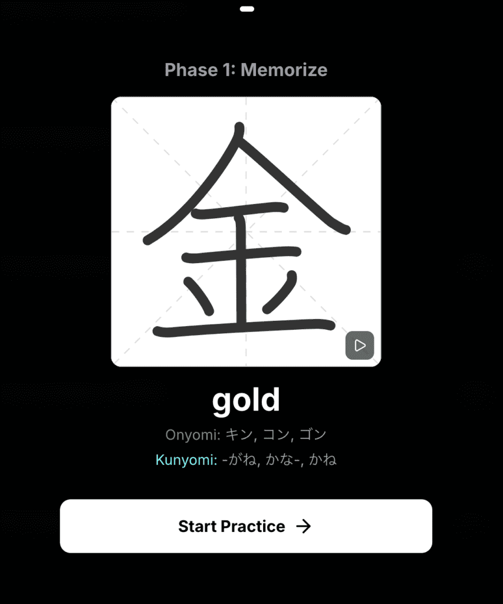

# Kanji Kaisen – Learn Japanese Kanji Through Play, Not Memorization

I built **Kanji Kaisen**, a web app that transforms kanji learning from tedious homework into an engaging game.

**Try it here:** [https://kanji-kaisen.harrysui.me](https://kanji-kaisen.harrysui.me/)

## The Problem with Traditional Kanji Learning

We know kanji are pictograms, but to beginners, they look like chaotic tangles of strokes. Most learning methods treat them as thousands of random symbols to memorize—which is overwhelming and inefficient.

## A Radical Solution

Kanji Kaisen reorganizes kanji around their **radicals (部首/bushu)**—the 214 fundamental building blocks that form all characters. Instead of memorizing random symbols, you learn a **rule-based system** where complex kanji become logical combinations:

- 氵(water) + 每 (every) = 海 (sea) → "water everywhere"

- 木 (tree) + 木 (tree) = 林 (forest) → "two trees"

Once you understand the radicals, thousands of kanji suddenly make sense.

## Key Features

**🖌️ AI Stroke Recognition**  
Draw kanji on screen and receive instant feedback on stroke order and accuracy.

**🧩 Master the Building Blocks First**  
Learn 214 radicals systematically, then watch complex characters become intuitive.

**🎮 Gamified Learning**  
XP progression, daily streaks, elemental categories (Fire/Water/Nature), spaced repetition, and challenge modes keep you motivated.

**📖 Mnemonic Stories**  
Every radical includes origin stories and memory hooks—no rote memorization required.

## Why I'm Sharing This

I'd love your honest feedback! Whether it's about the UI/UX, the radical categorization system, bugs you encounter, or suggestions for improvement—all input helps make this better for learners.

The app is **completely free to use**, so jump in and explore!

## Links

**App:** [https://kanji-kaisen.harrysui.me](https://kanji-kaisen.harrysui.me/)  
**GitHub:** [https://github.com/mxggle/kanji-kaisen](https://github.com/mxggle/kanji-kaisen)

