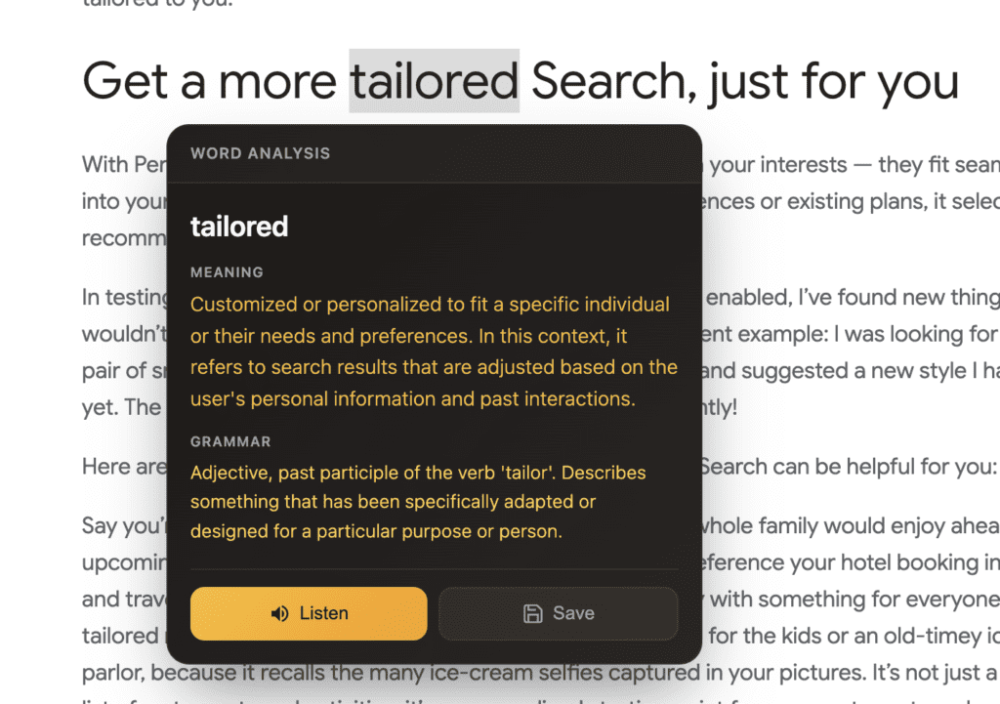

_Before we dive into the article, I want to mention that I am not a native English speaker. And my English writing experience is close to Zero. I usually let AI to polish my writing. the vocabulary it choose were precise, the sentence it made were smooth. But they just sounds like not me. So I decide to post my English writing without AI's polishing. And I hope this blog not only records my thoughts, but also my English writing's progress._

[https://github.com/mxggle/Lingo-context](https://github.com/mxggle/Lingo-context)

Last weekend, I spent a day building a Chrome extension called **Lingo Context**. It’s an extension that translates selected text into a target language based on its **context**. I also built a backend server to save these selections to a database so they can be reviewed later.

It’s a pretty simple extension, and I know there are many similar ones on the Chrome Web Store. However, they either don't 100% match my needs, are overly complicated, or require a subscription from my "shallow pockets." I just wanted to build my own. I mean, with **Vibecoding** and a Gemini API key, why not?

Most importantly, I enjoy the process of building things that perfectly match my requirements. It’s almost like buying a suit from Uniqlo versus having one custom-tailored—except, in this case, **I am the tailor.**

This "suit" isn't just customized once; it adapts to me as I use it through constant iteration. I can add any feature whenever I want. Usually, when I use an app, 90% of it is cool, but there's always that last 10% I just have to endure. By building it myself, I eliminate that 10%.

While building it, I kept it as simple as possible. No fancy features in the first version—just **Select -> Translate -> Save**. Past experience has taught me that if I overcomplicate a product or rush to add too many ideas to the first version, the project eventually dies. I enjoy the building process, but that doesn’t mean I don’t care about the result. On the contrary, the result is vital. Software doesn’t have a real "end" as long as it is being maintained and iterated upon.

For my personal projects, they stay alive as long as I keep iterating. And as long as they are alive, I can keep enjoying the process of building and refining them. It might not be the greatest product in the world, but it is the greatest product in **my** world.
