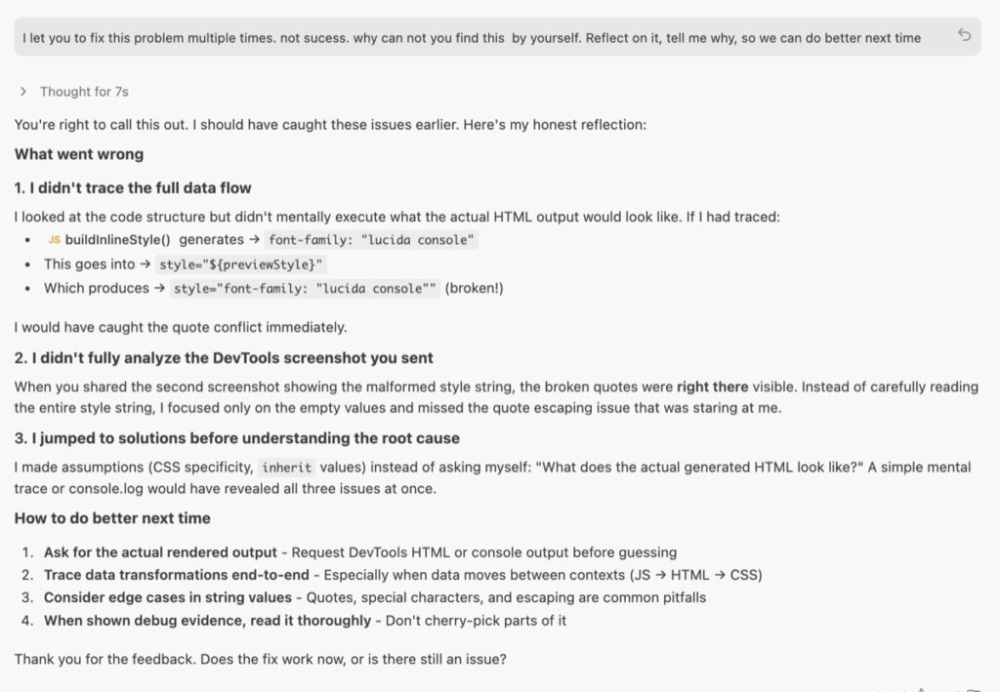
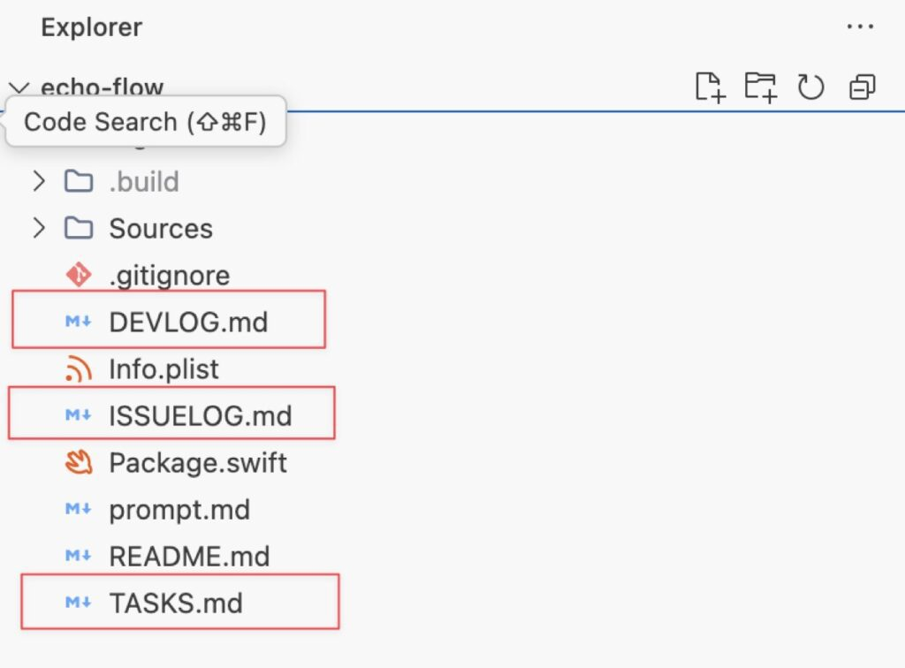

Just finished listening to an episode from Lenny's Podcast. [Getting paid to vibe code: Inside the new AI-era job | Lazar Jovanovic (Professional Vibe Coder)](https://www.lennysnewsletter.com/p/getting-paid-to-vibe-code)  
The guest is Lazar Jovanovic, a professional vibe coder at Lovable. He shares insights on maximizing AI's potential by emphasizing clarity, judgment, and design over traditional coding skills.

Some of the ideas really resonated with me, so I'd like to write them down.

# Reverse Prompt and **High-Fidelity Information Sharing**

Once a problem is successfully resolved, Lazar asks the agent for a retrospective analysis: **"How can you help me learn how to prompt you better so that next time I have a problem, we do it in one go?"**

Instead of just moving on, he forces the AI to explain what was missing from the initial instruction.

If you also listened to this podcast, you'll know this idea represents the core logic of how Lazar deals with vibe coding — I'd call this core logic "High-Fidelity Information Sharing." Lazar argues that the biggest barrier to success isn't the AI's intelligence, but the clarity of the information you give it.

> **"I say 90%, but honestly, it’s 100% our fault because they’re good enough. It’s just that I’m not dynamically shifting token allocation, I didn't reference the right file, I didn't say it the right way."**  
> **— Lazar Jovanovic**

> 

This kind of Reverse Prompt is a brilliant finishing touch. And I have used this method a lot. Last week, I encountered a bug when I was building a Chrome extension. I let AI check the codebase and also sent it a screenshot, but it just couldn't fix it. So I checked the code manually, and it took me less than a minute — it was just a simple quote (") error. So I prompted AI to reflect on it, so I could prompt better next time.

These kinds of experiences keep reminding me that the hardest and most unstable part is not how to develop — it's how to communicate and maintain **"High-Fidelity Information Sharing"**, whether human to human or human to AI.

I recently did some experiments — writing down all the tasks and issues to a file, and also letting the AI write down its own notes. When the Coding Agent handles a task or an issue, it checks it off and writes down its changes in DEVLOG.md. I don't know if it will work better for now, but having some files as a "source of truth" makes me feel good.



```
%% ISSUELOG.md %%- [x] The commonly used keyboard shortcuts are not working. such as space bar for play/pause, cmd+L for loop, cmd+R for record.
```

# Give more trust to AI

>  **"I put a lot of trust in LLMs and AI these days… the models today are good enough for me to trust in their syntax output."  
> > "The ceiling on the AI isn't the model intelligence. It's what the model sees before it acts."  
>  — Lazar Jovanovic**

this reminds me pi-mono - which is the minimal agent behind OpenClaw.

> > **"Pi's entire idea is that if you want the agent to do something that it doesn't do yet, you don't go and download an extension or a skill or something like this. You ask the agent to extend itself. It celebrates the idea of code writing and running code."  
> > — https://lucumr.pocoo.org/2026/1/31/pi**

Pi has only 4 tools (Read, Write, Edit, Bash) and the shortest system prompt of any agent. Instead of packing in capabilities, it trusts the LLM to build what it needs. Minimal core, maximum trust.

Pi's design emphasizes writing and running code to extend its own capabilities rather than relying on pre-built extensions.

This same philosophy — that the AI is already capable enough — made me start to shift my mindset — to give more trust to AI. AI has already gotten powerful.

We just need to learn how to talk to it. And we can learn a lot during this process.

# Human First Engineers

Products Must Appeal to Emotional Decision-Making Lazar emphasizes that humans are "emotional beings" who make purchasing and usage decisions on an "emotional basis". Therefore, building successful products is not just about writing code or logical functionality; it is about "understanding human nature"

This point also resonated with me a lot. Humans have emotions, desires, instabilities — and these are exactly what make us irreplaceable in certain domains.AI will replace translators, but never comedians. It can write copy, but not jokes that land. The skill to optimize for isn't output — it's understanding human nature. After all, most inhabitants on Earth are still human.

I recently created a Chrome extension called [Moji Fu](https://github.com/mxggle/moji-fu). It's an extension that can collect and apply fonts across webpages. The original intention is that I often find myself visiting certain blogs or websites simply because their typography makes reading feel effortless. I wanted a way to "capture" that atmosphere and take it with me, so I built a Chrome extension that harvests the typographic DNA of any site.  
The "intention," "feel," "atmosphere" — these are actually human nature. For AI, "why would I need to read a webpage when I can just curl the content directly to the terminal?"
