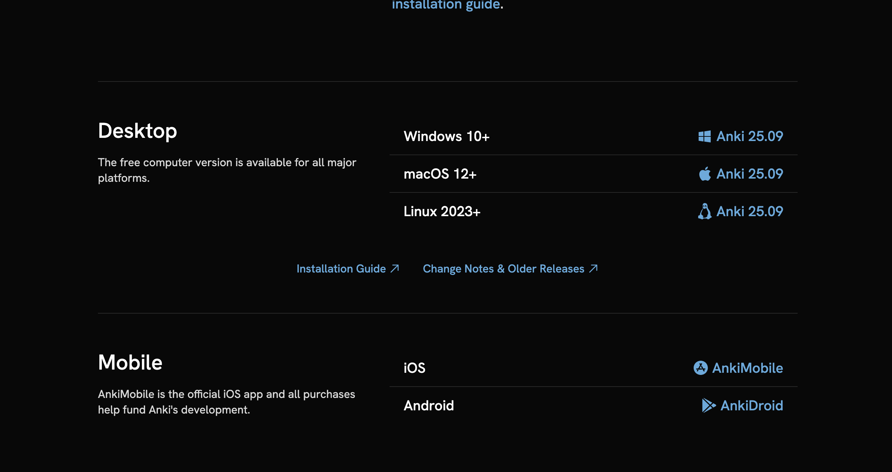
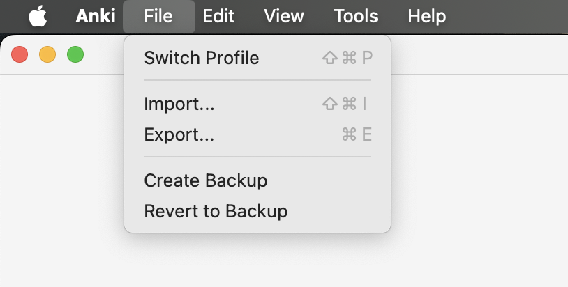

很多人听过 Anki 是记忆神器，但下载后发现界面像上个世纪的软件，直接就被“劝退”了。其实，只要搞清楚下面这三步，你就能轻松上手。

## 第一步：下载安装，认准正版，别花冤枉钱

Anki 是开源软件，它的正版逻辑很简单：**电脑端和安卓端完全免费**，只有苹果手机端，也就是 iOS 版，需要付费。

1. **电脑版，Windows / Mac**

   这是 **核心版本**，建议一定安装。

   - 官网下载：[apps.ankiweb.net](https://apps.ankiweb.net/)
   - 认准这个网址，别去搜索引擎里乱点广告。

2. **安卓版，AnkiDroid**

   **完全免费。**

   - 可以直接去手机自带应用商店搜索 `AnkiDroid`
   - 如果搜不到，就去官网点击 Android 图标，下载对应的 APK 安装包

3. **苹果版，AnkiMobile**

   这是唯一收费的官方版本，价格大概一百多人民币。

   小白提示：它基本也是官方维持服务器和生态的重要收入来源。如果你暂时不想买，也可以先用电脑端，或者直接用手机浏览器打开 `ankiweb.net` 免费刷卡。

---

## 第二步：如何快速获得内容，导入牌组

很多新手一想到 Anki，就以为得自己一张一张手动做卡片，于是当场失去求生欲。其实完全没必要。

网上已经有很多人分享现成的牌组，比如：雅思词汇、日语 N2、考研政治等等。你可以先用现成资源上手，再决定要不要自己做。

1. **获取文件**

   你下载到的 Anki 资源，通常后缀名是 `.apkg`。

2. **电脑端导入，最简单**

   - 打开 Anki
   - 点击下方的 **导入文件**
   - 选择下载好的 `.apkg` 文件
   - 确认导入

3. **手机端导入**

   - 先把文件传到手机里
   - 在 AnkiDroid 菜单中选择“导入”
   - 或者直接在文件管理器里点那个文件，选择“用 AnkiDroid 打开”

---

## 第三步：到底该怎么“用”这个软件

Anki 不是拿来“看”的，而是拿来“考”自己的。

1. **点开一个牌组**

   点击“开始学习”。

2. **先看问题，再自己回想答案**

   屏幕会先出现问题，比如一个单词，或者一句例句。**先别急着看答案**，先在脑子里认真想一下。

3. **看答案，然后诚实评分**

   点“显示答案”之后，下方会出现几个按钮。**这才是 Anki 的核心。**

   - **重来，Again**：没想起来，或者答错了，就点它。Anki 会很快再让你看一遍。
   - **良好，Good**：想起来了，但不算特别轻松。这通常会是你最常点的按钮。
   - **简单，Easy**：这题已经熟到不行了，点它，Anki 可能会很久以后才让你再复习。

Anki 的“魔法”就在这里：你越觉得难的卡片，它出现得越频繁。你已经滚瓜烂熟的东西，它就不会一直来烦你。

---

## 避坑与坚持的小建议

- **不要贪多**：刚开始每天新增 10 到 20 张卡片就够了。上来就加太多，后面的复习量会把你直接送走。
- **注册账号同步**：建议在电脑上注册一个 AnkiWeb 账号。这样你白天在手机上刷，晚上回家用电脑也能同步进度。
- **它是工具，不是目的**：别把时间都花在界面美化和插件折腾上。真正重要的，还是你有没有持续刷卡。

下面这个链接是我自己做的一些 Anki 卡片，欢迎直接拿去用：

<https://ankiweb.net/shared/by-author/497821666>
